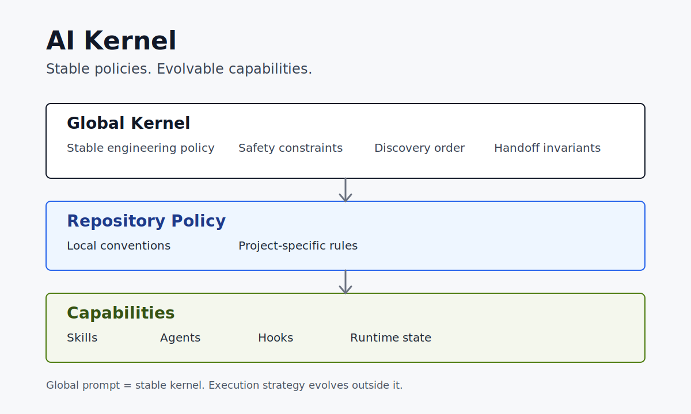

# AI Kernel

Stable policies. Evolvable capabilities.

AI Kernel is a governance-first foundation for AI coding assistants. It treats
your global prompt as a small, stable policy kernel instead of a growing
workflow manual.

## The Problem

AI coding agents often start with a useful global prompt. Then the prompt grows:

- engineering principles
- tool preferences
- workflow details
- model routing
- agent orchestration internals
- project-specific rules
- one-off incident fixes

Eventually the global prompt becomes noisy, contradictory, and hard to maintain.
The assistant has more text to obey, but less clear policy.

## The Model

Keep long-lived policy stable. Move execution details to places that can evolve.



```text
Global Kernel
  - Stable engineering policy
  - Safety constraints
  - Discovery order
  - Handoff invariants

Repository Policy
  - Local conventions
  - Project-specific rules

Capabilities
  - Skills
  - Agents
  - Hooks
  - Runtime state
```

In practice:

- Global prompt = stable policy kernel
- Repository prompt = local project conventions
- Skills, agents, hooks, and runtime = evolvable execution capabilities
- Session state = ephemeral task context

## A Kernel Example

From [`kernel/CLAUDE.md`](kernel/CLAUDE.md):

```md
<core_rules>
Read first, then write. Surgical and simple. Match existing local style.
Expose conflicts. Fail explicitly, never silently.
Prefer repository conventions over global preferences when conflicts exist.
</core_rules>
```

This is the kind of policy that belongs in a global kernel: stable, short, and
useful across projects.

Tool-specific workflows, project commands, model routing choices, and temporary
task state should live outside the kernel.

## The Worktree Failure

The strongest reason for this repo is not prompt aesthetics. It is continuity.

I once told agents that all changes must happen in a newly created worktree.
After handoff, the next agent obeyed perfectly and created another worktree.

The bug was not the agent. The bug was my policy model.

Worktrees should be task-scoped, not agent-scoped:

```text
task -> assigned worktree -> multiple agents
```

The fixed rule is in [`kernel/handoff-worktree.md`](kernel/handoff-worktree.md):
continue an existing task in its assigned worktree, and create a new worktree
only for a new independent implementation task.

## Directory Overview

- [`kernel/CLAUDE.md`](kernel/CLAUDE.md): a production-ready global prompt
  template.
- [`kernel/governance.md`](kernel/governance.md): rules for changing stable
  policy.
- [`kernel/handoff-worktree.md`](kernel/handoff-worktree.md): task-scoped
  worktree and handoff continuity guidance.
- [`kernel/README.md`](kernel/README.md): the boundary between kernel policy and
  evolvable capabilities.
- [`docs/launch-copy.md`](docs/launch-copy.md): ready-to-post launch copy for
  X, Hacker News, Reddit, and chat communities.
- [`assets/ai-kernel-model.svg`](assets/ai-kernel-model.svg): a shareable
  layered model diagram.

## Who This Is For

This repo is for people using AI coding agents such as Claude Code, Codex,
OpenCode, Qoder, or custom multi-agent workflows.

It is especially useful if you:

- maintain a large global `CLAUDE.md`, `AGENTS.md`, or equivalent prompt
- hand off work between agents or sessions
- use skills, hooks, subagents, or runtime memory
- want clearer boundaries between global policy and project policy

## How To Adapt It

1. Copy [`kernel/CLAUDE.md`](kernel/CLAUDE.md) into your global assistant policy
   location.
2. Remove or adjust personal rules you do not want, such as the adherence test in
   `<MUST_OBEY>`.
3. Keep project-specific conventions in each repository's prompt files.
4. Put execution strategies in skills, agents, hooks, scripts, or runtime state.
5. Use [`kernel/governance.md`](kernel/governance.md) before adding new permanent
   global rules.

## Principles

- Stable policies belong in the global kernel.
- Project conventions belong in repository policy.
- Execution strategies belong in skills, agents, hooks, and runtime.
- Runtime state should be preserved across handoff, not promoted into permanent
  policy.
- A single incident should not become a global rule without review.
